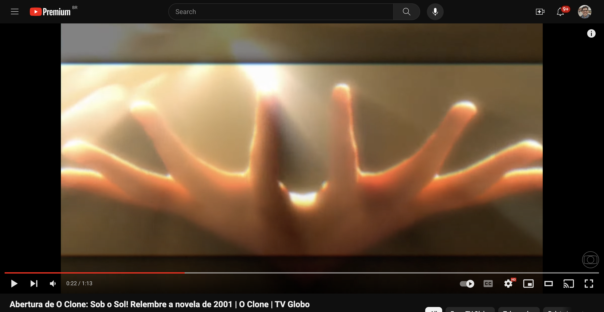
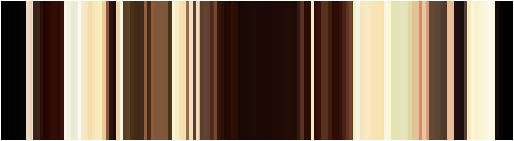

# Video Color Spectrum

This repository contains the script to extract the color spectrum of a YouTube video using defined algorithm configs. The pipeline for a single video can be divided into 4 steps:

1. Download an YouTube video
2. Break the video into its frames
3. Apply smoothing pre-processing to the frames
4. Extract the most predominant colors for each frame

An extensive explanation of the pipeline can be found in [this medium article]().

### Example

By applying the pipeline for [this video](https://www.youtube.com/watch?v=eAS0XDyI_M8), we get the following color spectrum:






# Running the pipeline

## Install dependencies

The pipeline uses libraries specific libraries like:

- `PyYAML`: reads configuration files
- `opencv-python`: video and image manipulation
- `mlflow`: experiments tracking

To install all dependencies, run:

```bash
pip install -r requirements
```

## Execute pipeline

To run the pre-defined configs, execute the following command:

```bash
make run
```

Results are stored on local files but they are also saved using the experiments structure of the `mlflow` framework. To start an `mlflow` server and see the results, run the following command:

```bash
make server
```

## Define alternative configs

Once you successfully run the pipeline for the standard configs, you can apply it to other YouTube videos with other pipeline parameters. To do so, edit the `configs.yaml` file which is structured as follows:

```yaml
# Smooth preprocessing parameters
smooth:
  method: GaussianBlur # options: AverageBlur, MedianBlur, GaussianBlur
  kernel_size: 1

# Clustering parameters
color_extraction:
  method: KMeans # options: KMeans, DBSCAN
  params:
    # Sklearn clustering parameters
    n_clusters: 3

-
    output_folder: abertura-hora-1 # extraction experiment/output folder
    url: https://www.youtube.com/watch?v=BNaT9M5-Q1o # YouTube URL video
    resolution: 144p # video resolution (defaults to 144p)
```